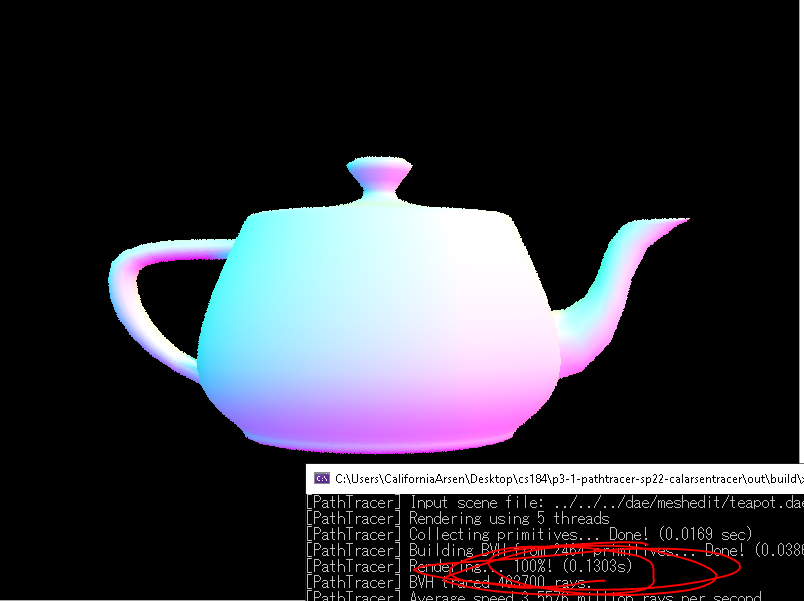

# Project 3-1 Write-Up

# **Overview**

This project was the first part of a two part assignment that involves implementing a raytracing program that can render an image with rays, and calculate the lighting at a given point using the other rays in the scene. **Part 1** was about generating basic camera rays to intersect with simple triangle and sphere shapes in the camera space, and project that intersection to draw a pixel onto the screen. For the time being, only a simple lighting system was employed, one that attributed RGB values to whatever the normal vector of a primitive was. The camera rays were generated by using a coordinate plane transform to get the input image coordinates and project to camera space, then using another transform to get to camera space. The ray's max_t and min_t are set to the fClip and nClip variables. The raytrace_pixel function in pathtracer.cpp generates multiple camera rays from the same input point, and averages the illumination at that point with a basic Monte Carlo estimator. The intersect function I had for triangles was originally a plane intersection check, as well as a point-in triangle test, but that wasn't giving accurate results, so I eventually implemented it with the Moller-Trombore algorithm, which gave more accurate t values. The sphere intersection follows the slides. **Part 2** was about speeding up the drawing process by creating a BV hierarchy to split up the mesh. The first task constructs the BVH tree structure, with pointers at given primitives for the box. The second is an intersection function for bbox's where a range of two t's are updated and used. For the last task, I had to do the intersection functions for the whole BVH tree, which skips over bounding boxes that a ray definitely doesn't hit, and only checks the primitives contained in a leaf node. This function works recursively (as did the construction in the first place).

## **Part 1**

The rendering pipeline is as follows: the raytrace_pixel function starts by taking an arbitrary number of samples of an input point. Each time a sample point is generated, the generate_ray function is called to generate its respective ray. This ray is then used in the est_radiance_global_illumination function, which handles the intersection functions that were implemented in the latter half of this part. The intersect first calls an intersect function for the BVH, which then calls intersection functions for respective primitives as deemed necessary. The triangle intersection function took a lot of time to get to work consistently, especially before doing Moller-Trombore. The main issue was that the normal calculation with the barycentric coordinates was always a little bit off, leading to some holes in the meshes whenever they were drawn. Doing Moller-Trombore helped with making the barycentric coordinates more accurate, although I needed to put in some if statements to reject t values that gave barycentric coordinates with values not between 0.0 and 1.0. Otherwise the calculation portion was very much linear algebra. There also needed to be checks to reject invalid t values.

 

These are some small .dae files that were generated with only normal shading. The resolutions were at 800 x 600.

## **Part 2**

My construction function for the BVH involves organizing and reordering the main vector of primitives for the BVHAccel class. As it is reorganized properly, the recursive calls to the function to create the BVH tree will stop at the creation of some new leaf node, and assign the BVHNode's start and end class variables to the start and end iterators of that primitives vector, as it encompasses whatever that leaf node holds as primitives in its bbox. The main difficulty came from dealing with the primitives vector, as I had to figure out how to organize that thing such that a good split between the primitives could be achieved. I tried other heuristics, but tended to get many situations where all the primitives would end up on one side, so the one that I went with in the end was, I held the minimums and maximums of all centroid coordinates (x, y, z), used that to calculate the range of the longest x-axis, y-axis, or z-axis, and then sorted that section of primitives by the coordinate value that had the longest range. Thereafter, I just split the group into half; the left hand held the first half of the vector, and the right half held the other. To this end, I had to make a "quicksort" function to use on the original primitives vector; one that only worked on one part of the vector as a whole. I found inspiration for this function online, and credited that in the code's comments.

The following were two .dae files that I previously couldn't render without the BVH implementation (they took longer than 5-10 minutes), but that I could in less than a second with the implementation of this part.

  

The next two images were ones with moderately complex geometries, that I chose to compare the rendering times for BVH implemented and not implemented. The first is the cow.dae file in meshedit, which is a very minimal design, and took 37 seconds to render before BVH, and 0.1 seconds to render after BVH. The other one is teapot.dae, also from meshedit. It took 15.8 seconds to render before, and also 0.1 seconds to render after.

 
 

The main thing to consider with BVH is how much rendering time can be saved using the bboxes. The point of the bbox in the first place is to segment the meshes contained in a scene in such a way that primitives' relative location is preserved in each smaller bbox. By doing so, when one is testing whether a ray intersects with some primitives, instead of testing every single primitive in the scene individually, if a ray does not intersect with some bbox, and thereby does not cross into the relative area wherein a primitive is located, then any calculations that would have been done with those primitives are henceforth ignored, and in this way, a lot of time is saved by ignoring potentially thousands upon thousands of negligible calculations. Although time can build up if a scene is filled with bounding boxes that are all still stacked against each other, time is still reduced substantially. As seen with the timing results above, one can significantly reduce rendering time to a near constant amount (although it's still be logarithmic because of the tree structure of BVH).

One other bit of difficulty I encountered during this project, was in the bbox intersection function. I did use the slide regarding ray intersection with an axis-aligned box, and I did apply this for three planes surrounding the bbox; however, it took a while to realize that the ray could come from a direction where a previously minimum x-axis would become a maximum one, and vice versa, so I kept getting issues with false negatives, where a bbox would get missed completely. This was solved simply by taking t-value intersections with axes indiscriminately, and taking the max t value and min t value of each pair by which was bigger or smaller than the other.

# Miscellaneous

[Link to Proj3-1 Github](https://github.com/cal-cs184-student/p3-1-pathtracer-sp22-calarsentracer)

[Link to Webpage: https://cal-cs184-student.github.io/sp22-project-webpages-CalArsen/](https://cal-cs184-student.github.io/sp22-project-webpages-CalArsen/)

[Link to Proj3-1 Write-Up](https://cal-cs184-student.github.io/sp22-project-webpages-CalArsen/proj3-1/index.html)
